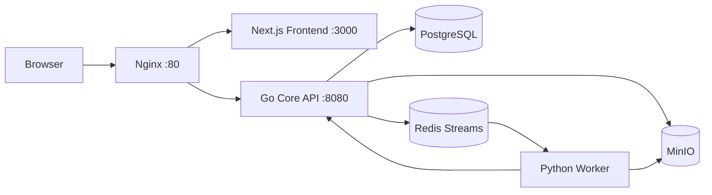

# 01 Inventory（全量资产盘点）

## 1) 仓库全景

- 扫描范围：仓库根目录及全部子目录（排除 `.git/**` 与运行期 `__pycache__`）。
- 文件总数（当前工作树）：287（含本轮产出文件）。
- 顶层目录结构（关键）：
  - `go-core/`：Go Fiber API + 业务核心
  - `python-worker/`：Redis Stream 消费与图像/AI任务执行
  - `frontend/`：Next.js 前端与 API 代理
  - `docker-compose.yml` / `nginx/nginx.conf`：运行与反向代理拓扑
  - `outline/`：设计与路线文档
  - `log/`：迭代日志

## 2) 技术栈识别

- Go Core
  - Go 版本：`go 1.24.0`（`go-core/go.mod:3`）
  - Web：Fiber v2（`go-core/go.mod:6`）
  - 数据层：GORM + PostgreSQL（`go-core/go.mod:12-13`）
  - 队列：Redis Streams（`go-core/go.mod:10`，`go-core/queue/redis.go:35-99`）
  - 对象存储：MinIO SDK（`go-core/go.mod:9`）
- Python Worker
  - 依赖：`redis/minio/pillow/rawpy/openai/google-genai/anthropic/...`（`python-worker/requirements.txt:1-17`）
  - 主循环：`python-worker/main.py:1551-1652`
- Frontend
  - Next.js 16 + React 19（`frontend/package.json:18-21`）
  - ESLint 脚本存在（`frontend/package.json:9`）

## 3) 运行入口识别

- Go 服务入口：`go-core/main.go:318`
- Python worker 入口：`python-worker/main.py:1651-1652`
- 前端入口：Next.js App Router（`frontend/src/app/layout.tsx`）
- 编排入口：`docker-compose.yml:3-112`

## 4) 模块职责映射（初稿）

| 模块 | 主要职责 | 关键证据 |
|---|---|---|
| Go Core API | 身份认证、资源访问控制、业务 API、内部回写接口 | `go-core/main.go:406-770`, `1193-1237`, `2236-2280` |
| Queue Publisher | 任务入队（图像处理、AI、导出等） | `go-core/queue/redis.go:35-99` |
| Python Worker | 消费 Redis Streams、处理图片/AI/导出并回写 | `python-worker/main.py:1564-1645` |
| PostgreSQL | 用户/照片/作业/配置等主数据 | `go-core/models/models.go:10-302` |
| MinIO | 原图/代理图/缩略图/导出文件对象存储 | `go-core/storage/minio.go:34-47`, `go-core/main.go:1156-1161` |
| Redis | Stream 队列与限流计数 | `go-core/queue/redis.go:35-99`, `go-core/main.go:201-225` |
| Next.js Frontend | 页面渲染、前端 API 代理 | `frontend/src/app/api/**/route.ts`, 例：`frontend/src/app/api/photos/route.ts:3-29` |
| Nginx | 统一入口、限流、SSE 反代配置 | `nginx/nginx.conf:19-22`, `74-86`, `89-127` |

## 5) 当前部署拓扑（Mermaid）

## 6) 运行与安全基线观察

- Compose 中多个服务存在默认回退口令（如 Redis/MinIO/JWT）风险（`docker-compose.yml:20`, `31-32`, `57`）。
- `.env` 含真实样式密钥，属于高敏感资产（`.env:7-9`）。
- Go Core 对 `INTERNAL_SECRET` 强制校验启动（`go-core/main.go:323-326`），但 JWT 允许不设并使用默认值（`go-core/main.go:320-321`）。

## 7) 产出说明

- 全量文件目录清单与用途/风险标签：`01_file_catalog.csv`
- 后续轮次将基于本清单输出代码级映射、SaaS 差距评分、目标架构与迁移路线。
